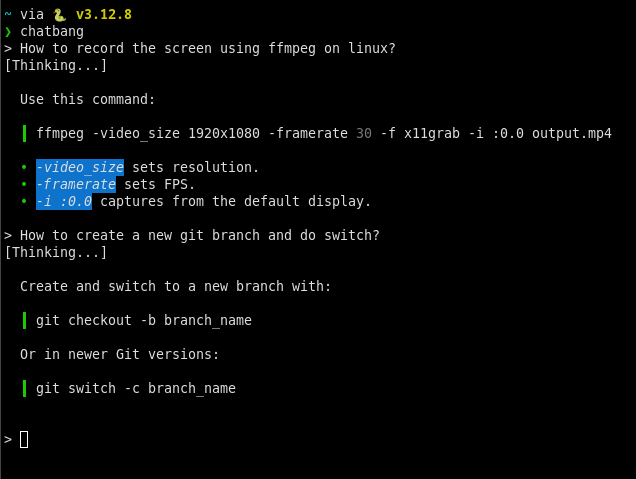

# Chatbang

`Chatbang` is a simple tool to access ChatGPT from the terminal, without needing for an API key.



## Installation

On Linux:

```bash
curl -L https://github.com/ahmedhosssam/chatbang/releases/latest/download/chatbang -o chatbang
chmod +x chatbang
sudo mv chatbang /usr/bin/chatbang
```

Install from source:

```bash
git clone git@github.com:ahmedhosssam/chatbang.git
cd chatbang
go mod tidy
go build main.go
sudo mv main /usr/bin/chatbang
```


## Usage

It's very simple, just type `chatbang` in the terminal.
```bash
chatbang
```

## Configuration

Note: You need to execute `chatbang --config` at least once to create the config file in the directory `$HOME/.config/chatbang`.

`Chatbang` requires a Chromium-based browser (e.g. Chrome, Edge, Brave) to work, so you need to have one installed. And then make sure that the config file points to the right path of your chosen browser in the default config path for `Chatbang`: `$HOME/.config/chatbang/chatbang`.

It's default is:
```
browser=/usr/bin/google-chrome
```

Change it to the right path of your favorite Chromium-based browser.

Note: `Chatbang` doesn't work when the browser is installed with `Snap`, the only option right now is to install it in `/bin` or `/usr/bin`.

Then, you need to log in to ChatGPT in `Chatbang`'s Chromium session, so you need to do:
```bash
chatbang --config
```
That will open `Chatbang`'s Chromium session on ChatGPT's website, log in with your account.

Then, you will need to allow the clipboard permission for ChatGPT's website (on the same session).

## How it works?

`Chatbang` works by scraping ChatGPT's website. It opens ChatGPT on a headless session when you execute `Chatbang` and take your prompt and paste it in ChatGPT's prompt area and execute that prompt, then it waits for the response and copies it as a markdown format and then render it in the terminal.
